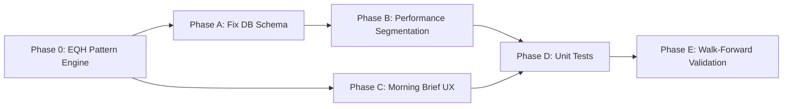

# Side-by-Side Backtest — Existing Features Audit & Implementation Plan

_Last updated: 2026-04-17_

---

## 1. System Overview

The `side_by_side_backtest/` package is a self-contained intraday trading system built around the **bearish Side-by-Side White Lines** candlestick pattern. It ingests scraped watchlist posts, fetches 5-min OHLCV bars, scores live setups, runs event-driven backtests, and presents results in a multi-page Streamlit UI.

### Architecture at a Glance

```
scraped_watchlists.json
        │
        ▼
  [parser.py]  ──────────────────────────────────────────────────►  SQLite (db.py)
  Parse raw text → WatchlistEntry objects
        │
        ▼
  [data_fetcher.py]
  Download 5-min OHLCV (yfinance / Alpaca) → ohlcv_cache/ parquets
        │
        ▼
  [simulator.py]  ──  [pattern_engine.py]  ──  [sr_engine.py]
  Event-driven backtest: support touch → pattern confirm → entry
        │
        ▼
  [optimizer.py / auto_tuner.py]
  Grid sweep or Bayesian (Optuna) PT/SL optimisation
        │
        ▼
  [report.py]  →  console / CSV / PNG heat-maps
        │
        ▼
  [app.py → pages/]
  Streamlit UI: Morning Brief | Chart Viewer | Performance Analytics
```

---

## 2. Module-by-Module Feature Inventory

### 2.1 `models.py` — Data Schemas
| Model | Purpose | Status |
|-------|---------|--------|
| `SessionType` | Enum: pre_market / market_open / after_hours / unknown | ✅ Complete |
| `WatchlistEntry` | Parsed ticker + support/resistance/stop + session | ✅ Complete |
| `RawWatchlist` | Raw scraped post container | ✅ Complete |
| `OHLCV` | Single 5-min bar | ✅ Complete |
| `PatternMatch` | Detected pattern with confidence score + type | ✅ Complete |
| `TradeResult` | Full trade record with outcome, PnL, analysis tags | ✅ Complete |
| `BacktestSummary` | Aggregated stats for one PT/SL combination | ✅ Complete |
| `OptimizationResult` | Full sweep output container | ✅ Complete |

**Gaps:** No `JournalEntry` model for manual trade logging. No `Alert` model for persisting live-scanner alerts.

---

### 2.2 `parser.py` — Watchlist Text Parser
| Feature | Status |
|---------|--------|
| Ticker extraction via `$TICKER` and `TICKER:` regex | ✅ Complete |
| Price-level extraction (support / resistance / stop) | ✅ Complete |
| Session-type detection (pre-market / AH / open keywords) | ✅ Complete |
| Batch parse from JSON file (`parse_scraped_file`) | ✅ Complete |
| Timestamp extraction from raw post | ✅ Complete |

**Gaps:** No LLM-assisted fallback for ambiguous posts. No confidence score on parsed levels.

---

### 2.3 `db.py` — SQLite Storage Layer
| Feature | Status |
|---------|--------|
| `watchlist_entries` table with upsert (idempotent re-runs) | ✅ Complete |
| `trades` table for backtest results | ✅ Complete |
| WAL journal mode + foreign keys | ✅ Complete |
| Context-manager interface (`with WatchlistDB() as db`) | ✅ Complete |
| `load_trades()` / `load_entries()` query methods | ✅ Complete |

**Gaps:** The `trades` table is **missing the analysis-tag columns** added to `TradeResult` after initial schema creation: `support_source`, `pattern_type`, `bars_since_pattern`, `entry_attempt`. These fields exist in the Pydantic model but are **not persisted to SQLite** — they are computed in-memory only and lost after the run. The Performance Analytics page therefore cannot filter/segment by pattern type or entry attempt number.

---

### 2.4 `data_fetcher.py` — OHLCV Data Layer
| Feature | Status |
|---------|--------|
| yfinance 5-min download with HTTP-level cache (requests-cache) | ✅ Complete |
| Alpaca Markets provider (optional, env-var keyed) | ✅ Complete |
| 30-day rolling parquet cache (`*_30d_5m.parquet`) | ✅ Complete |
| Per-entry window fetch (lookback + forward around post date) | ✅ Complete |
| Parallel batch fetch via `ThreadPoolExecutor` | ✅ Complete |
| Banned-ticker list (persistent JSON, skips delisted symbols) | ✅ Complete |
| `refresh_today()` for live intraday bar refresh | ✅ Complete |

**Gaps:** No Polygon.io provider. No intraday real-time websocket feed.

---

### 2.5 `pattern_engine.py` — Pattern Detection
| Feature | Status |
|---------|--------|
| Strict bearish Side-by-Side White Lines (3-candle) | ✅ Complete |
| ADX trend filter (default >20) | ✅ Complete |
| C1 body-size filter (≥1.5× avg body) | ✅ Complete |
| C2/C3 body symmetry filter (within 50%) | ✅ Complete |
| `detect_exhaustion_side_by_side` variant (doji/widening C3) | ✅ Complete |
| `detect_support_absorption` variant (volume spike near support) | ✅ Complete |
| `pattern_near_support` proximity filter | ✅ Complete |
| Confidence scoring (1.0 strict / 0.7 absorption / 0.6 exhaustion) | ✅ Complete |

**Gaps:** No bullish S×S variant (intentionally excluded). No multi-timeframe pattern confirmation.

---

### 2.6 `sr_engine.py` — Support & Resistance Engine
| Feature | Status |
|---------|--------|
| Classic Pivot Points (Floor Trader: P, R1/R2, S1/S2) | ✅ Complete |
| Local Extrema fractal highs/lows with zone clustering | ✅ Complete |
| Volume Profile — Point of Control (POC), VAH, VAL | ✅ Complete |
| K-Means clustering of highs/lows (optional, sklearn) | ✅ Complete |
| `detect_role_reversals` — former resistance now support | ✅ Complete |
| `count_rejections` — wick rejections off support | ✅ Complete |
| `SRLevels.nearest_support/resistance` helpers | ✅ Complete |
| Price-range filter to keep only nearby levels | ✅ Complete |

**Gaps:** No VWAP-anchored support levels. No overnight gap-fill level detection.

---

### 2.7 `simulator.py` — Event-Driven Backtest Engine
| Feature | Status |
|---------|--------|
| Phase A: Body-based support touch detection (not wick) | ✅ Complete |
| Phase B: Wait-for-bar-close confirmation | ✅ Complete |
| Pattern lookback gate (last N bars) | ✅ Complete |
| Entry at next bar open | ✅ Complete |
| Take-Profit (TP) at configured % above entry | ✅ Complete |
| Stop-Loss (SL) at configured % below entry | ✅ Complete |
| Hard max-loss cap (prevents gap-through blowouts) | ✅ Complete |
| Time-stop at session close (per session type) | ✅ Complete |
| Trailing stop with activation threshold | ✅ Complete |
| Multi-trade per session (state machine resets after exit) | ✅ Complete |
| Consecutive-loss cooldown (30-min after N losses) | ✅ Complete |
| Max entry attempts cap per session | ✅ Complete |
| Penny-stock gate (skip entries below $0.10) | ✅ Complete |
| Pre-trade risk filter (support too far below entry) | ✅ Complete |
| Stale-support exclusion (>15% above median price) | ✅ Complete |
| Watchlist resistance as TP override (capped at 1.5× PT) | ✅ Complete |
| `support_ok` / `support_respected` tagging | ✅ Complete |
| `require_support_ok` filter (default on) | ✅ Complete |
| Pre-computed caches for fast auto-tune re-runs | ✅ Complete |
| `simulate_all` multi-entry batch runner | ✅ Complete |

**Gaps:** No position-sizing model (all trades are flat-size). No slippage/commission model. No overnight gap simulation. Analysis tags (`support_source`, `pattern_type`, `bars_since_pattern`, `entry_attempt`) computed but **not saved to DB**.

---

### 2.8 `optimizer.py` — Grid Sweep Optimizer
| Feature | Status |
|---------|--------|
| PT × SL grid sweep | ✅ Complete |
| `compute_summary` — aggregate trades to `BacktestSummary` | ✅ Complete |
| `summaries_to_dataframe` — pivot to pandas for heatmaps | ✅ Complete |
| Per-session win-rate breakdown | ✅ Complete |
| Best-by metrics (win_rate, profit_factor, expectancy) | ✅ Complete |

**Gaps:** No walk-forward validation of optimised parameters.

---

### 2.9 `auto_tuner.py` — Bayesian Optimiser
| Feature | Status |
|---------|--------|
| Optuna TPE sampler over PT/SL/tolerance search space | ✅ Complete |
| Configurable objective (expectancy / profit_factor / win_rate) | ✅ Complete |
| Min-trades guard per trial | ✅ Complete |
| Trial CSV export | ✅ Complete |
| Progress bar via tqdm | ✅ Complete |

**Gaps:** No multi-objective Pareto optimisation. No out-of-sample validation gate.

---

### 2.10 `setup_scorer.py` — Live Setup Scorer (11 components)
| Component | Score Range | Status |
|-----------|-------------|--------|
| `pattern_score` — S×S near support | 0–2 | ✅ Complete |
| `adx_score` — ADX trend strength | 0–2 | ✅ Complete |
| `rr_score` — Risk/Reward ratio | 0–2 | ✅ Complete |
| `confluence_score` — S/R method agreement | 0–2 | ✅ Complete |
| `history_score` — Ticker win-rate from DB | 0–2 | ✅ Complete |
| `role_reversal_score` — Former resistance now support | 0–2 | ✅ Complete |
| `rejection_score` — Wick rejections off support | 0–2 | ✅ Complete |
| `rel_vol_score` — Relative volume vs same-TOD median | 0–2 | ✅ Complete |
| `macd_score` — MACD histogram slope | 0–2 | ✅ Complete |
| `rsi_div_score` — Bullish RSI divergence | 0–2 | ✅ Complete |
| `regime_score` — 30-min EMA higher-timeframe context | 0–2 | ✅ Complete |
| SR cache (TTL=300s, thread-safe) | — | ✅ Complete |
| `support_ok` / `support_broken` flags | — | ✅ Complete |
| Score normalised to 0–10 (raw/22 × 10) | — | ✅ Complete |

**Gaps:** No intraday volume-spike score (unusual options activity). No float/short-interest score. Component weights are all equal — no learned weighting from backtest outcomes.

---

### 2.11 `report.py` — CLI Report Generator
| Feature | Status |
|---------|--------|
| Rich console table (graceful plain-text fallback) | ✅ Complete |
| `optimization_results.csv` export | ✅ Complete |
| PT × SL heatmaps (win_rate, profit_factor, expectancy) | ✅ Complete |
| Equity curve PNG | ✅ Complete |

**Gaps:** No per-ticker breakdown chart. No drawdown chart.

---

### 2.12 `sanity_check.py` — 6-Check Diagnostic Suite
| Check | Description | Status |
|-------|-------------|--------|
| A | Win-rate vs random baseline (shuffle test) | ✅ Complete |
| B | Support-respected rate (how often price held) | ✅ Complete |
| C | Duplicate trade detection | ✅ Complete |
| D | Parameter sensitivity (results stable across PT/SL range) | ✅ Complete |
| E | Per-ticker breakdown (no single ticker driving all edge) | ✅ Complete |
| F | Time-of-day bias check | ✅ Complete |

**Gaps:** No data-leakage check. No overfitting detection via in/out-of-sample split.

---

### 2.13 `watchlist_builder.py` — Auto-Build from Cache
| Feature | Status |
|---------|--------|
| Build `WatchlistEntry` list from ohlcv_cache/ parquets | ✅ Complete |
| Rolling prior-window support (no data leakage) | ✅ Complete |
| Same-window support option (`--same-window-support`) | ✅ Complete |
| CLI entry point | ✅ Complete |

---

### 2.14 `refresh_cache.py` — Daily Cache Maintenance
| Feature | Status |
|---------|--------|
| Initial 30-day seed fetch | ✅ Complete |
| Daily incremental update (fetch today, merge, prune) | ✅ Complete |
| `--full` force re-fetch | ✅ Complete |
| Parallel fetch via ThreadPoolExecutor | ✅ Complete |

---

### 2.15 `live_scanner.py` — Real-Time Terminal Scanner
| Feature | Status |
|---------|--------|
| Poll loop (configurable interval, default 5 min) | ✅ Complete |
| ANSI banner alert | ✅ Complete |
| macOS desktop notification via osascript | ✅ Complete |
| `afplay` sound alert (effect.mp3) | ✅ Complete |
| Per-ticker dedup (no repeat alerts same support) | ✅ Complete |

**Gaps:** No push to Streamlit session. No webhook/Slack output. Runs only as CLI, not embedded in the app.

---

### 2.16 `chart_viewer.py` — Interactive Chart (884 lines)
| Feature | Status |
|---------|--------|
| TradingView-style dark theme (Plotly) | ✅ Complete |
| 5-min OHLCV candlesticks | ✅ Complete |
| Session shading (pre/regular/AH) | ✅ Complete |
| Pattern markers (yellow diamonds) | ✅ Complete |
| Support / resistance lines | ✅ Complete |
| Entry/exit trade overlays (cyan entry, green/red/grey exits) | ✅ Complete |
| Volume bar sub-chart | ✅ Complete |
| 30d rolling cache + legacy window file support | ✅ Complete |
| Deep-link from Morning Brief and Performance pages | ✅ Complete |

---

### 2.17 Streamlit Pages
| Page | Features | Status |
|------|---------|--------|
| `1_morning_brief.py` | Ranked setup table, score cards, live-scan fragment, toast alerts, score sparklines, dedup by ticker | ✅ Complete |
| `2_chart_viewer.py` | Thin adapter to chart_viewer.py | ✅ Complete |
| `3_performance.py` | Overall metrics, equity curve vs QQQ benchmark, PnL histogram, per-ticker table, drill-to-chart deep-link | ✅ Complete |

**Gaps for Morning Brief:** No "Journal" tab for logging manual trades. No export of ranked table to CSV. No filter by minimum score threshold.

**Gaps for Performance page:** Cannot segment by `pattern_type` or `entry_attempt` (those fields not persisted to DB). No drawdown curve. No Sharpe/Sortino display. No session-type filter.

---

## 3. Consolidated Gap Analysis

### Priority 1 — Critical Data Integrity Bug
| Gap | Impact |
|-----|--------|
| **DB schema missing analysis-tag columns** (`support_source`, `pattern_type`, `bars_since_pattern`, `entry_attempt`) | Trade analytics, filtering, and learning from past trades are all blocked. These are computed in the simulator but thrown away. Fixing this unlocks the entire segmentation capability of the Performance page. |

### Priority 2 — High-Value Missing Features
| Gap | Impact |
|-----|--------|
| **Performance page: pattern_type / entry_attempt segmentation** | Can't answer "do strict S×S patterns beat exhaustion?" or "is the 1st touch better than the 3rd?" |
| **Performance page: drawdown curve + Sharpe/Sortino** | No risk-adjusted return metrics visible anywhere in the UI. |
| **Performance page: session-type filter** | Pre-market vs market-open comparison is a key research question. |
| **Morning Brief: minimum score filter widget** | Traders want to hide SKIP setups without scrolling. |
| **Morning Brief: export ranked table to CSV** | No way to save a daily snapshot for journaling. |

### Priority 3 — Improvements to Existing Features
| Gap | Impact |
|-----|--------|
| **Walk-forward validation for auto-tune** | Bayesian-found parameters may overfit; no OOS check exists. |
| **No slippage/commission model in simulator** | Backtest results are optimistic — real fills have cost. |
| **No unit tests for simulator or setup_scorer** | Regressions possible when editing core logic. |
| **`live_scanner.py` not integrated into Streamlit app** | Terminal-only scanner can't push alerts to the Morning Brief page already running in the browser. |
| **`main.py` `--tickers` pipeline missing `--require_support_ok` in phase log** | Minor: the log line omits the `require_support_ok` flag status. |

### Priority 4 — Nice-to-Have Enhancements
| Gap | Impact |
|-----|--------|
| No VWAP or overnight gap-fill S/R levels | Edge feature for gap-down setups |
| No float/short-interest overlay | Context for micro-cap squeeze setups |
| No Polygon.io data provider | Faster real-time data alternative |
| No per-ticker breakdown chart in CLI report | Visual gap in batch backtest output |

---

## 4. NEW FEATURE: Equal Highs / S×S as Resistance Breakout Pattern

### 4.1 What the trader is showing (image analysis)

From the four reference images:

| Image | Ticker | Pattern | Level | Outcome |
|-------|--------|---------|-------|---------|
| IMG_5448 | HR | Yellow (bull) + Black (bear) candle, **both open at ~$8.59** | Yellow S/R line | Price drops hard after pair — rejection |
| IMG_5497 | BIRD | Yellow (bull) + Black (bear), **both open at ~$23.10** | Yellow S/R line | Explosive move if $23.57 red resistance breaks |
| IMG_5451 | Arrive AI | Same mixed pair at $1.30 | Yellow S/R line | Rejection; targets $1.42 resistance if break |
| IMG_5452 | Arrive AI | Same at $1.35 | Yellow S/R line | Collapse to $1.22 on rejection |

**The pattern definition (trader's mental model):**
- C1: Any candle (context candle)
- C2: One candle (bullish OR bearish) opening at a key level
- C3: The **opposite-color** candle opening at **the same price** as C2 (within tolerance)
- The pair (C2+C3) sits AT or ABOVE a support/resistance line
- This defines an **Equal Highs (EQH) / Liquidity Ceiling** level at `max(C2.open, C3.open)`

**Two trade modes from this one pattern:**

```
Mode A — Rejection (Sell / Exit signal):
  Trigger: Candle after C3 closes its BODY BELOW the pair's low
  Meaning: Sellers defended the level; bulls failed; hard decline incoming
  Action:  Exit position immediately

Mode B — Breakout (Long entry signal):
  Trigger: Candle after C3 closes its BODY ABOVE the pair's high
  Meaning: Overhead supply absorbed; stop-losses of shorts triggered; explosive move
  Action:  Enter long; stop below the EQH level; target = next resistance
```

### 4.2 Current code gap

[`detect_side_by_side()`](../side_by_side_backtest/pattern_engine.py:226) — line 226 **hard-requires all three candles bearish**. The new EQH pattern requires **mixed colors** (one bull + one bear with matching opens). The existing exhaustion and absorption detectors also require at least C2+C3 bearish.

**None of the existing detectors can find the trader's circled patterns.** The `detect_support_absorption()` function at line 412 is the closest — it allows one bullish candle in C2/C3 — but it requires C1 to be a large bearish candle that lands *at support*, not at *resistance*.

### 4.3 New function to add: `detect_equal_highs_pair()`

**File:** [`side_by_side_backtest/pattern_engine.py`](../side_by_side_backtest/pattern_engine.py)

**Logic:**
```
For each bar i (C3 candidate):
  C2 = bar i-1, C3 = bar i

  1. Mixed-color check: (C2 bullish AND C3 bearish) OR (C2 bearish AND C3 bullish)
     → this is the distinguishing feature vs. all existing detectors

  2. Same-open check: |C3.open - C2.open| / C2.open <= open_tolerance_pct (default 2%)
     → defines the "equal highs" level at the pair

  3. Body quality: both C2 and C3 must have body >= min_body_pct of bar range
     → filters doji candles (indecision not conviction)

  4. EQH level = max(C2.open, C3.open)  — the "ceiling" price

  5. Returns PatternMatch with:
       pattern_type = "eqh_pair"
       confidence_score = 0.8
       candle2_open = C2.open  (the level)
       candle3_open = C3.open  (the matching open)
```

**New `PatternMatch` fields needed:** `eqh_level: float` (the ceiling price) and `signal_mode: str` ("breakout" | "rejection" | "forming") — **OR** encode in `pattern_type` as `"eqh_breakout"` vs `"eqh_rejection"` once the trigger bar fires.

**Breakout/Rejection detection function:** `detect_eqh_signal(df, eqh_patterns)` — scans bars after each EQH pair and fires:
- `pattern_type = "eqh_breakout"` when `bar.close > eqh_level * (1 + body_clear_pct)` (body fully above)
- `pattern_type = "eqh_rejection"` when `bar.close < pair_low * (1 - body_clear_pct)` (body fully below)

### 4.4 Simulator changes for EQH Breakout mode

**File:** [`side_by_side_backtest/simulator.py`](../side_by_side_backtest/simulator.py)

Add an optional `eqh_breakout_mode: bool = False` parameter to `simulate_entry()`.

When `True`, the entry logic changes:
- **Phase A (scan):** Instead of waiting for price to touch *support from above*, scan for EQH pairs forming at/near current price overhead
- **Phase B (entry trigger):** Enter long when a bar closes its body *above* the EQH pair high (not at next open — use close-of-signal-bar open)
- **Exit logic:** Same TP/SL structure; SL placed at EQH level (if price closes below the pair, thesis dead)
- Existing bearish S×S mode is **unchanged** — both modes run independently

### 4.5 Chart Viewer changes

**File:** [`side_by_side_backtest/chart_viewer.py`](../side_by_side_backtest/chart_viewer.py)

Add EQH visual overlays:
- **Yellow dashed horizontal line** at EQH level (distinct from existing white support line)
- **Orange square marker** on the C3 completion bar of an EQH pair (distinct from existing yellow diamond S×S marker)
- **Green upward arrow** when `eqh_breakout` fires
- **Red downward arrow** when `eqh_rejection` fires
- Toggle in sidebar: "Show EQH levels" checkbox

### 4.6 Setup Scorer changes

**File:** [`side_by_side_backtest/setup_scorer.py`](../side_by_side_backtest/setup_scorer.py)

Add `eqh_score` as a **12th component** (replacing or supplementing `pattern_score`):
- Score 2.0: EQH pair detected within last 10 bars AND price is within 0.5% of the EQH level (approaching it)
- Score 1.0: EQH pair detected but price is 0.5–2% away (building up to the level)
- Score 0.0: No EQH pair found

**Morning Brief card additions:**
- Show EQH level if detected: "EQH ceiling: $X.XX"
- Show signal: "🟡 Approaching EQH" / "🟢 EQH breakout fired" / "🔴 EQH rejected"

---

## 5. Implementation Plan (Ordered by Priority)

### Phase 0 — Equal Highs Breakout Pattern (NEW — Highest Priority)

**Goal:** Implement the mixed-color twin-pair EQH detector and integrate it across all layers.

**Files to change:**
1. [`models.py`](../side_by_side_backtest/models.py) — Add `eqh_level: float = 0.0` field to `PatternMatch`. Add `eqh_level`, `eqh_signal` fields to `SetupScore` dataclass in `setup_scorer.py`.
2. [`pattern_engine.py`](../side_by_side_backtest/pattern_engine.py) — Add `detect_equal_highs_pair(df, open_tolerance_pct=0.02)` (mixed-color twin with matching opens) and `detect_eqh_signal(df, eqh_patterns, body_clear_pct=0.003)` (breakout/rejection trigger scanner).
3. [`setup_scorer.py`](../side_by_side_backtest/setup_scorer.py) — Add `_score_eqh(bars, current_price)` component; add `eqh_score` to `SetupScore`; update normalisation from `/22` to `/24`.
4. [`chart_viewer.py`](../side_by_side_backtest/chart_viewer.py) — Add EQH level dashed line, orange square pair markers, green/red breakout/rejection arrows, sidebar toggle.
5. [`simulator.py`](../side_by_side_backtest/simulator.py) — Add `eqh_breakout_mode: bool = False` to `simulate_entry()`; alternate entry logic when enabled.
6. [`main.py`](../side_by_side_backtest/main.py) — Add `--eqh` CLI flag to enable EQH breakout simulation mode.
7. [`pages/1_morning_brief.py`](../side_by_side_backtest/pages/1_morning_brief.py) — Add EQH ceiling display and signal badge to setup cards.

---

### Phase A — Fix DB Schema & Persist Analysis Tags

**Goal:** Save `support_source`, `pattern_type`, `bars_since_pattern`, and `entry_attempt` from every `TradeResult` into the `trades` SQLite table so the Performance Analytics page can segment them.

**Files to change:**
1. [`db.py`](../side_by_side_backtest/db.py) — Add 4 columns to `CREATE TABLE trades` DDL; add `ALTER TABLE` migration for existing DBs; update `upsert_trades()` INSERT to include new fields; update `load_trades()` SELECT to read them back.
2. [`simulator.py`](../side_by_side_backtest/simulator.py) — Already sets these fields on `TradeResult`; no logic change needed — just confirm they flow through to `simulate_all`'s return values.
3. [`main.py`](../side_by_side_backtest/main.py) — Ensure `db.upsert_trades(trades)` is called after each phase run (currently may not be called at all after single-pass; verify and wire up).

---

### Phase B — Performance Page: Segmentation + Risk Metrics

**Goal:** Add three new analytical sections to [`3_performance.py`](../side_by_side_backtest/pages/3_performance.py):

1. **Pattern-type breakdown table** — group trades by `pattern_type`, show win-rate + expectancy per type.
2. **Entry-attempt breakdown** — group by `entry_attempt` (1st touch vs 2nd vs 3rd+), show if early touches outperform.
3. **Drawdown curve** — plot running max-drawdown alongside the equity curve.
4. **Risk metrics row** — add Sharpe ratio, Sortino ratio, max drawdown % to the Overall Summary metrics bar.
5. **Session-type filter** — sidebar `st.selectbox` to filter the entire page by session.

---

### Phase C — Morning Brief UX Improvements

**Goal:** Three small additions to [`1_morning_brief.py`](../side_by_side_backtest/pages/1_morning_brief.py):

1. **Minimum score slider** — `st.slider("Min score", 0.0, 10.0, 4.0)` in the sidebar; filter ranked table and cards to only show tickers at or above threshold.
2. **Export to CSV button** — `st.download_button` that serialises the current ranked table DataFrame to CSV.
3. **Session-type count badge** — Show "N pre-market | M market-open | K after-hours" totals above the ranked table.

---

### Phase D — Unit Tests for Core Engine

**Goal:** Add a `tests/unit/test_simulator.py` and `tests/unit/test_setup_scorer.py` covering the most critical paths:

- `test_simulator.py`: TP hit, SL hit, time-stop, trailing stop activation, penny-stock gate, max-attempts cap.
- `test_setup_scorer.py`: `_score_adx`, `_score_rr`, `_score_confluence`, score normalisation (sum of 22 → 10).

---

### Phase E — Walk-Forward Validation for Auto-Tuner

**Goal:** After Bayesian optimisation finds best PT/SL, split the entry list into in-sample (first 70%) and out-of-sample (last 30%) by chronological order. Re-run `compute_summary` on OOS data with the best parameters and report OOS metrics alongside IS metrics so overfitting is visible.

**Files to change:**
- [`auto_tuner.py`](../side_by_side_backtest/auto_tuner.py) — Add `validate_oos` boolean param; if True, after study finishes, slice entries by date, run OOS simulation, append OOS metrics to `AutoTuneResult`.
- [`main.py`](../side_by_side_backtest/main.py) — Print OOS metrics in the auto-tune summary section.

---

## 6. Recommended Implementation Order

```
Phase 0  →  Phase A  →  Phase B  →  Phase C  →  Phase D  →  Phase E
 EQH          DB fix      Analytics    UX          Tests       Walk-fwd
 Pattern     (blocks B)  (unlocked     (quick      (safety     (research
 Engine                   by A)         wins)       net)        quality)
```

Mermaid dependency diagram:



---

## 7. Files Changed by This Plan

| File | Phase | Change Type |
|------|-------|-------------|
| [`pattern_engine.py`](../side_by_side_backtest/pattern_engine.py) | 0 | Add `detect_equal_highs_pair()` + `detect_eqh_signal()` |
| [`models.py`](../side_by_side_backtest/models.py) | 0 | Add `eqh_level` field to `PatternMatch` |
| [`setup_scorer.py`](../side_by_side_backtest/setup_scorer.py) | 0 | Add `eqh_score` component + `eqh_level`/`eqh_signal` to `SetupScore` |
| [`chart_viewer.py`](../side_by_side_backtest/chart_viewer.py) | 0 | Add EQH visual overlays |
| [`simulator.py`](../side_by_side_backtest/simulator.py) | 0 | Add `eqh_breakout_mode` parameter |
| [`main.py`](../side_by_side_backtest/main.py) | 0 + A | Add `--eqh` flag; wire `db.upsert_trades()` |
| [`pages/1_morning_brief.py`](../side_by_side_backtest/pages/1_morning_brief.py) | 0 + C | EQH card display; min-score slider; CSV export; session badges |
| [`db.py`](../side_by_side_backtest/db.py) | A | Add 4 analysis-tag columns to trades table |
| [`pages/3_performance.py`](../side_by_side_backtest/pages/3_performance.py) | B | Pattern-type/entry-attempt tables; drawdown curve; Sharpe/Sortino; session filter |
| [`auto_tuner.py`](../side_by_side_backtest/auto_tuner.py) | E | OOS validation |
| `tests/unit/test_simulator.py` | D | New file |
| `tests/unit/test_setup_scorer.py` | D | New file |
| `tests/unit/test_pattern_engine.py` | D | New file |

## 8. Files NOT Changed by This Plan

- [`parser.py`](../side_by_side_backtest/parser.py)
- [`sr_engine.py`](../side_by_side_backtest/sr_engine.py)
- [`optimizer.py`](../side_by_side_backtest/optimizer.py)
- [`watchlist_builder.py`](../side_by_side_backtest/watchlist_builder.py)
- [`refresh_cache.py`](../side_by_side_backtest/refresh_cache.py)
- [`live_scanner.py`](../side_by_side_backtest/live_scanner.py) _(future candidate)_
- [`chart_viewer.py`](../side_by_side_backtest/chart_viewer.py)
- [`report.py`](../side_by_side_backtest/report.py)
- [`sanity_check.py`](../side_by_side_backtest/sanity_check.py)
- [`models.py`](../side_by_side_backtest/models.py)
- [`data_fetcher.py`](../side_by_side_backtest/data_fetcher.py)
- [`app.py`](../side_by_side_backtest/app.py)

---
