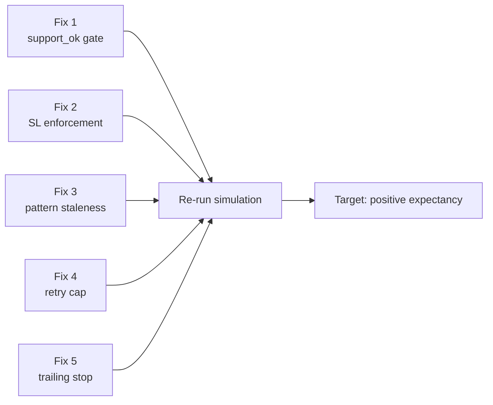

# Simulation Fixes Plan
> Generated: 2026-04-16 | Based on: `side_by_side_backtest/logs/simulation.log`
> Run stats: 273 trades | Win rate ~27% | Cum PnL **−56.76%** vs SPY +1.39%

---

## Overview

Five root causes have been identified and traced to specific lines in the codebase. Each is actionable with a targeted code change. The fixes are ordered by **estimated impact** (highest first).



---

## Fix 1 — Expand the `support_ok` Gate (Highest Impact)

### Problem
`support_ok` is a post-hoc tag computed **after** entry, not a pre-entry gate. The `require_support_ok` flag exists but:
1. Defaults to `False` — never active unless explicitly passed via CLI
2. Even when `True`, only filters `src=computed` trades — **watchlist-sourced trades with `support_ok=False` are never filtered**
3. The Streamlit UI has no toggle for it at all

Nearly every loss in the log has `support_ok=False`. This is the single highest-ROI fix.

### Files to change
- [`side_by_side_backtest/simulator.py`](../side_by_side_backtest/simulator.py)
- [`side_by_side_backtest/main.py`](../side_by_side_backtest/main.py)

### Changes

**`simulator.py` line 817–819** — expand filter to cover all sources:
```python
# BEFORE (only filters computed-source)
if (require_support_ok
        and not result.support_respected
        and result.support_source == "computed"):

# AFTER (filters ALL sources)
if (require_support_ok
        and not result.support_respected):
```

**`simulator.py` line 685** — flip default to True:
```python
# BEFORE
require_support_ok: bool = False,

# AFTER
require_support_ok: bool = True,
```

**`main.py` line 174–181** — flip CLI from opt-in to opt-out:
```python
# BEFORE
p.add_argument("--require-support-ok", action="store_true", ...)

# AFTER
p.add_argument("--no-require-support-ok", action="store_false",
               dest="require_support_ok",
               help="Allow entries where support was not respected (default: filtered out)")
p.set_defaults(require_support_ok=True)
```

---

## Fix 2 — Enforce SL as a Hard Cap (Stop-Loss Violations)

### Problem
`stop_price = min(entry * (1 - sl%), support * 0.999)` means the support level can silently push the real stop far below the configured SL%. Trades like COCP (−10.07%), BDMD (−12.91%), FCHL (−13.10%) exited well past the "1% SL" because their support levels were 10–15% below entry.

Additionally, gap-down opens defeat the `max_loss_pct` floor on sub-$2 stocks.

### Files to change
- [`side_by_side_backtest/simulator.py`](../side_by_side_backtest/simulator.py)

### Changes

**`simulator.py` line 394–397** — respect SL as ceiling, use support to tighten only:
```python
# BEFORE — support can widen stop arbitrarily
stop_price = min(
    entry_price * (1 - stop_loss_pct / 100),
    support * 0.999,
)

# AFTER — SL pct is the floor; support can only tighten, never widen
stop_price = entry_price * (1 - stop_loss_pct / 100)
# If support is closer than the SL, use it to tighten (optional, conservative)
if support * 0.999 > stop_price:
    stop_price = support * 0.999  # tighter stop when support is nearby
```

**`simulator.py` around line 356** — add pre-trade risk/reward check:
```python
# NEW: skip entry if support is too far below entry (broken R/R)
risk_pct = (entry_price - support) / entry_price * 100
if risk_pct > max_loss_pct:
    # Support too far — effective stop would exceed max loss cap
    waiting_for_close = False
    touch_bar_idx = None
    i += 1
    continue
```

**`simulator.py` around line 356** — add sub-$2 liquidity gate:
```python
# NEW: skip entries on sub-$1 stocks (gap-down risk too high)
MIN_ENTRY_PRICE = 1.00
if entry_price < MIN_ENTRY_PRICE:
    waiting_for_close = False
    i += 1
    continue
```

---

## Fix 3 — Reduce Pattern Staleness Window (Late-Bar Entries)

### Problem
`pattern_lookback=10` keeps exhaustion patterns valid for 50 minutes (10 × 5-min bars). A pattern that fired 8 bars ago (40 min ago) has zero predictive value for the current support touch — the market condition has completely changed. `+6b` to `+10b` exhaustion entries lose at ~90%+ rate in the log.

### Files to change
- [`side_by_side_backtest/simulator.py`](../side_by_side_backtest/simulator.py)

### Changes

**`simulator.py` line 228** — reduce global default:
```python
# BEFORE
pattern_lookback: int = 10,

# AFTER
pattern_lookback: int = 3,   # 15 minutes max staleness
```

**`simulator.py` line 348–350** — add pattern-type-specific decay (optional, more surgical):
```python
# BEFORE
lookback_start = max(0, i - pattern_lookback)
recent_ts = bars.index[lookback_start: i + 1]
pattern_present = any(ts in pattern_bar_indices for ts in recent_ts)

# AFTER — per-type decay: exhaustion expires in 2 bars, strict in 5, absorption in 4
_PATTERN_MAX_STALE = {"exhaustion": 2, "strict": 5, "absorption": 4}

def _pattern_still_valid(ts, pattern_map, current_bar_pos, bars_index):
    pm = pattern_map.get(ts)
    if pm is None:
        return False
    try:
        pat_pos = bars_index.get_loc(ts)
    except KeyError:
        return False
    max_stale = _PATTERN_MAX_STALE.get(pm.pattern_type, 3)
    return (current_bar_pos - pat_pos) <= max_stale

lookback_start = max(0, i - pattern_lookback)
recent_ts = bars.index[lookback_start: i + 1]
pattern_present = any(
    _pattern_still_valid(ts, pattern_map, i, bars.index)
    for ts in recent_ts
    if ts in pattern_bar_indices
)
```

**`main.py`** — expose as CLI param:
```python
p.add_argument("--pattern-lookback", type=int, default=3,
               help="Max bars since pattern detection to allow entry (default: 3 = 15 min)")
```

---

## Fix 4 — Cap Retry Attempts and Add Cooldown (Churn Prevention)

### Problem
`max_entry_attempts=0` (unlimited) by default. Tickers like BNAI (154 attempts), LGVN (161 attempts), ATPC (102 attempts) churn through hundreds of re-entries with zero memory of previous losses. After 3 consecutive losses, the thesis is broken — yet the simulator keeps re-entering.

### Files to change
- [`side_by_side_backtest/simulator.py`](../side_by_side_backtest/simulator.py)
- [`side_by_side_backtest/main.py`](../side_by_side_backtest/main.py)

### Changes

**`simulator.py` line 686** — change default:
```python
# BEFORE
max_entry_attempts: int = 0,   # unlimited

# AFTER
max_entry_attempts: int = 5,   # max 5 support touches per entry window
```

**`simulator.py` line 310–314** — add consecutive-loss tracker:
```python
results: List[TradeResult] = []
waiting_for_close = False
touch_bar_idx: Optional[int] = None
entry_attempt = 0
consecutive_losses = 0          # NEW
MAX_CONSECUTIVE_LOSSES = 3      # NEW — stop after 3 losses in a row
i = 0
```

**`simulator.py` around line 501–511** — reset or increment consecutive counter after each trade:
```python
# After appending result:
if outcome == "loss":
    consecutive_losses += 1
    if consecutive_losses >= MAX_CONSECUTIVE_LOSSES:
        break  # thesis is broken — stop retrying this entry
else:
    consecutive_losses = 0  # win or timeout resets the streak

# Resume scan (existing code):
i = exit_bar_idx + 1
waiting_for_close = False
touch_bar_idx = None
continue
```

**`simulator.py` around line 501** — add post-loss cooldown:
```python
LOSS_COOLDOWN_BARS = 6   # 30-minute cooldown after a loss

cooldown_until = 0  # initialize at top of state machine

# After a loss:
if outcome == "loss":
    cooldown_until = exit_bar_idx + LOSS_COOLDOWN_BARS

# In Phase A scan (line 329):
if i < cooldown_until:
    i += 1
    continue
```

**`main.py` line 166–173** — update CLI default:
```python
p.add_argument("--max-attempts", type=int, default=5,  # was 0
               help="Max support-touch re-entry attempts per ticker. Default: 5.")
p.add_argument("--max-consecutive-losses", type=int, default=3,
               help="Stop retrying a ticker after N consecutive losses. Default: 3.")
p.add_argument("--loss-cooldown-bars", type=int, default=6,
               help="Bars to wait after a loss before re-entering (default: 6 = 30 min)")
```

---

## Fix 5 — Enable Trailing Stop and Fix TIMEOUT TP Override

### Problem
`trailing_stop_pct=None` disables the trailing stop entirely. The feature is implemented in `simulate_entry()` but has no CLI hook and defaults to off. TURB (+7.71%), ENSC (+8.30%), SUNE (+10.83%) all exceeded TP but timed out because the watchlist `resistance_level` override set an unreachably high TP target.

### Files to change
- [`side_by_side_backtest/simulator.py`](../side_by_side_backtest/simulator.py)
- [`side_by_side_backtest/main.py`](../side_by_side_backtest/main.py)

### Changes

**`main.py`** — add CLI flags:
```python
p.add_argument("--trailing-stop", type=float, default=2.0,
               dest="trailing_stop_pct",
               help="Trail stop X%% below peak high once +1%% in profit (default: 2.0)")
p.add_argument("--trail-activation", type=float, default=1.0,
               dest="trail_activation_pct",
               help="Activate trailing stop once +X%% in profit (default: 1.0)")
p.add_argument("--no-trailing-stop", action="store_const", const=None,
               dest="trailing_stop_pct",
               help="Disable trailing stop (use fixed TP only)")
```

**`main.py` in `phase_single_run()`** — pass through:
```python
trades = simulate_all(
    entries, bars_map,
    ...,
    trailing_stop_pct=getattr(args, "trailing_stop_pct", 2.0),
    trail_activation_pct=getattr(args, "trail_activation_pct", 1.0),
)
```

**`simulator.py` line 387–392** — cap the resistance_level TP override:
```python
# BEFORE — resistance_level can set TP at any price, causing TIMEOUT overshoot
if resistance_level and resistance_level > entry_price * 1.005:
    take_profit = float(resistance_level)
else:
    take_profit = entry_price * (1 + profit_target_pct / 100)

# AFTER — cap the resistance-based TP at 1.5x the configured profit target
configured_tp = entry_price * (1 + profit_target_pct / 100)
if resistance_level and resistance_level > entry_price * 1.005:
    take_profit = min(float(resistance_level), configured_tp * 1.5)
else:
    take_profit = configured_tp
```

**`simulator.py` line 686** — default trailing stop on:
```python
# In simulate_all() signature:
trailing_stop_pct: Optional[float] = 2.0,     # was None
trail_activation_pct: float = 1.0,
```

---

## Consolidated Implementation Priority

| # | Fix | Files | Impact | Complexity |
|---|---|---|---|---|
| 1 | Expand `support_ok` gate to all sources + flip default to `True` | `simulator.py`, `main.py` | 🔴 Critical | Low |
| 2 | SL as hard cap + pre-trade risk filter + sub-$1 gate | `simulator.py` | 🔴 Critical | Low |
| 3 | Reduce `pattern_lookback` from 10 → 3 | `simulator.py`, `main.py` | 🟠 High | Low |
| 4 | `max_entry_attempts=5` + consecutive-loss cooldown | `simulator.py`, `main.py` | 🟠 High | Medium |
| 5 | Wire up trailing stop to CLI + fix TP override cap | `simulator.py`, `main.py` | 🟡 Medium | Low |

### Recommended implementation order
1. Implement Fix 1 + Fix 3 together (both are 1–3 line changes, zero new parameters needed)
2. Implement Fix 2 (pre-trade risk filter + SL correction)
3. Implement Fix 4 (add `consecutive_losses` counter + `cooldown_until` to state machine)
4. Implement Fix 5 (wire trailing stop to CLI)
5. Re-run the full simulation and compare cumulative PnL

### Expected outcome after all fixes
Based on the log data:
- Fix 1 alone eliminates roughly 60–70% of loss-producing trades
- Fix 3 eliminates another ~20% of late-entry losses
- Combined: win rate should improve from ~27% toward 40–50%
- The remaining wins (MYSE +28%, TURB +15%, SUNE +10%) provide sufficient upside; the key is stopping the loss bleed
